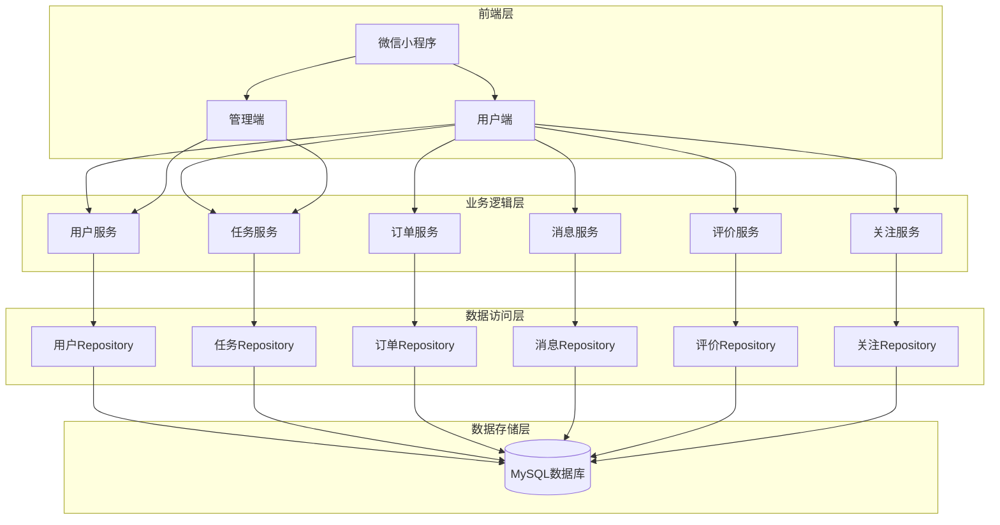
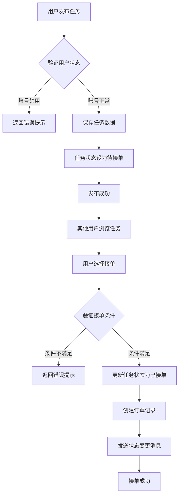
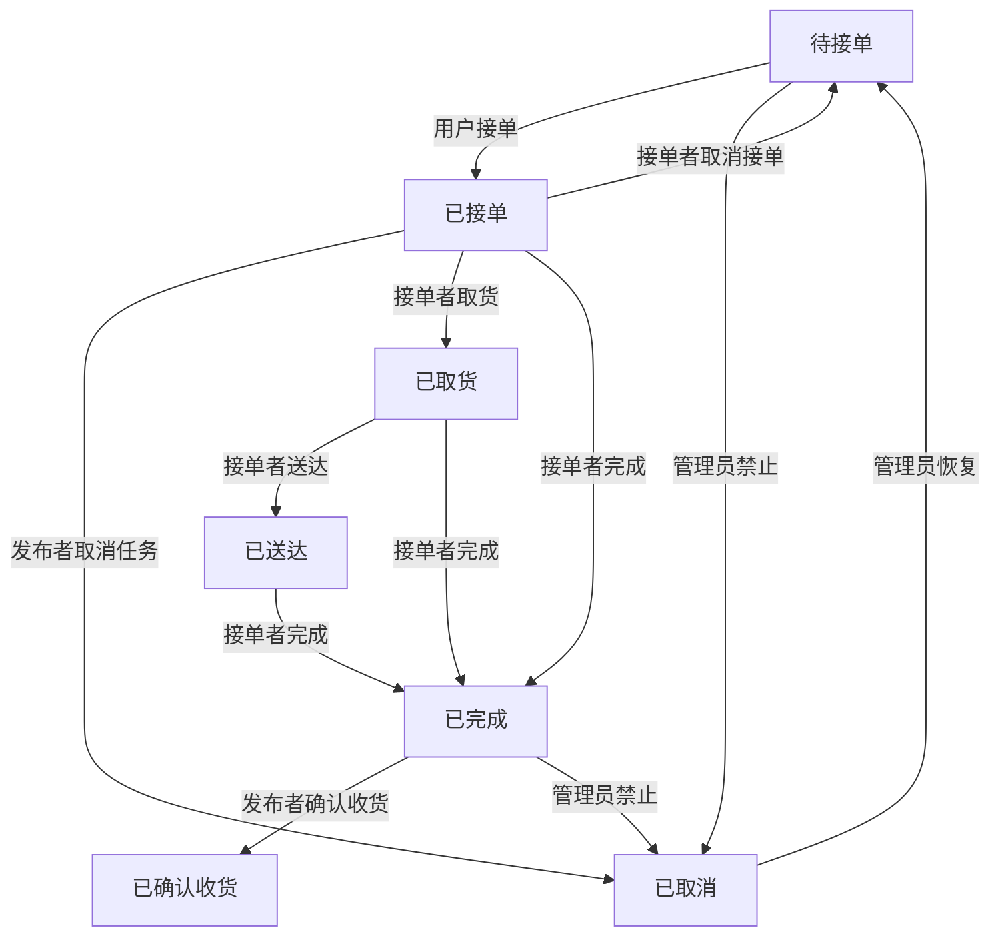

# 技术交底书

**案件名称**：一种校园跑腿服务平台的任务管理系统及方法

**技术联系人**：
- 姓名：[待填写]
- 电话：[待填写]
- 邮箱：[待填写]

**专利类型**：发明

---

## 注意事项

（1）交底书应使代理人能看懂，尤其是背景技术和详细技术方案，一定要写得全面、清楚、完整；
（2）技术的公开程度，应以本领域普通技术人员不需付出创造性劳动即可进行实施为准。
（3）在与代理人沟通时，对于代理人咨询的技术问题，应给予回答并认真讲解，并且按要求及时正确地补充相应技术材料。

---

## 一、介绍相关技术背景，描述与本发明技术最相近的现有技术，并说明该现有技术存在的缺点

### 1.1 现有技术

**检索说明**：在国家知识产权局专利公布公告系统及公开网络资源中，以"校园跑腿平台""任务管理系统""校园众包服务"等为检索词进行检索。

随着移动互联网的发展，校园生活服务平台逐渐兴起，跑腿服务作为其中重要的一环，解决了学生日常生活中的诸多不便。目前市面上存在多种跑腿服务平台，主要分为以下几类：

**（1）通用跑腿平台**
- 如美团跑腿、饿了么跑腿等，面向社会大众提供服务，覆盖范围广但针对性不强
- 平台定位偏向商业化，服务费用较高，不太适合校园场景

**（2）校园二手交易平台附带跑腿功能**
- 部分校园二手交易平台如闲鱼校园版等，提供简单的跑腿功能
- 功能单一，缺乏专门针对校园场景的优化设计

**（3）传统校园互助群**
- 通过微信群、QQ群等社交平台发布跑腿需求
- 缺乏规范管理，安全隐患大，交易难以保障

**（4）已有专利技术**

| 专利/文献 | 技术方案要点 | 应用场景 | 局限性 | 公开源 |
|-----------|--------------|----------|--------|--------|
| CN112862335A - 校园志愿者服务众包系统 | 包含小程序客户端和云端，提供任务发布、任务选择、个人信息管理等功能，基于工作者历史任务信息计算声誉值 | 校园志愿者服务众包 | 仅针对志愿者服务场景，未涉及商业化跑腿服务的订单管理、支付结算等核心功能 | https://patentimages.storage.googleapis.com/f1/34/ec/d1e4fd60775842/CN112862335A.pdf |
| 基于微信小程序的校园跑腿系统 | 用户角色管理、任务发布、接单管理、订单追踪、支付结算、信用管理六大模块 | 校园跑腿服务 | 信用管理仅基于接单完成率和超时次数，缺乏双向评价机制 | https://blog.csdn.net/QQ1039692211/article/details/153051978 |
| 校跑团平台 | 提供取快递、代购、代送等服务，支持API接口对接第三方平台 | 全国高校众包任务平台 | 侧重于配送调度，任务状态管理流程不够精细化 | https://www.jfoom.com/ |
| 校园跑腿服务管理平台 | 订单闭环管理、社区交流融合，支持管理员后台管理 | 校园跑腿服务管理 | 评价体系相对简单，缺乏针对校园场景的特殊监管机制 | https://blog.csdn.net/qq_46179813/article/details/155612017 |

### 1.2 现有技术存在的缺点

现有技术主要存在以下缺点：

1. **缺乏校园场景针对性设计**：通用跑腿平台未针对校园环境特点（如封闭性、安全性要求高、服务半径小等）进行优化；

2. **任务管理流程不完善**：多数平台的任务状态管理较为简单，缺乏精细化的状态流转控制，容易出现任务状态混乱；

3. **缺乏双向评价机制**：现有平台多为单向评价（用户评价服务者），缺乏服务者对用户的评价机制，难以建立公平的信用体系；

4. **安全保障不足**：传统社交平台方式缺乏身份认证和交易保障，存在安全风险；

5. **管理员监管功能缺失**：缺乏有效的任务审核和违规处理机制，难以维护平台秩序；

6. **信用等级计算单一**：现有信用管理主要基于接单完成率，未充分考虑用户评价等多维度因素。

---

## 二、针对上述缺点，说明本发明所要解决的技术问题

本发明旨在解决以下技术问题：

1. **针对校园场景优化**：提供专门针对校园环境的跑腿服务平台，满足校园用户的特定需求；

2. **完善任务状态管理**：设计精细化的任务状态流转机制，实现任务从发布到完成的全流程可控管理；

3. **建立双向评价体系**：实现发布者与接单者之间的双向评价，构建公平的信用评价机制；

4. **增强安全保障**：通过用户身份认证、订单记录等方式保障交易安全；

5. **提供管理员监管功能**：实现任务审核、违规处理等管理功能，维护平台秩序；

6. **多维度信用等级计算**：综合考虑评价评分、接单完成率等多维度因素计算用户信用等级。

---

## 三、本发明技术方案的详细阐述

### 3.1 背景

本发明针对校园场景设计了一套完整的跑腿服务平台，主要面向在校学生，提供代买、代送、取快递等服务。平台采用前后端分离架构，后端基于Spring Boot框架，前端采用微信小程序，通过RESTful API进行数据交互。

### 3.2 系统框图

### 3.3 模块功能说明

本系统主要包含以下核心模块：

**（1）用户服务模块**
- 负责用户注册、登录、信息管理等功能；
- 支持手机号注册，自动生成随机昵称；
- 维护用户余额、信用等级等信息；

**（2）任务服务模块**
- 负责任务的发布、接单、状态流转管理；
- 支持多种任务类型（代买、代送、取快递等）；
- 实现精细化的任务状态控制；

**（3）订单服务模块**
- 负责订单的创建、支付、完成等流程；
- 与任务服务联动，实现任务与订单的关联；

**（4）消息服务模块**
- 负责系统消息的推送；
- 支持订单状态变更通知；

**（5）评价服务模块**
- 实现发布者与接单者的双向评价；
- 支持评分、评语、标签等多种评价方式；
- 根据评价自动计算用户信用等级；

**（6）关注服务模块**
- 实现用户之间的关注功能；
- 支持关注列表管理；

### 3.4 系统流程说明

#### 3.4.1 任务发布与接单流程

#### 3.4.2 任务状态流转流程

### 3.5 关键技术参数

| 参数名称 | 符号 | 含义 | 取值范围 |
|----------|------|------|----------|
| 任务状态 | status | 表示任务当前所处状态 | 0-6 |
| 用户角色 | role | 表示用户权限级别 | 0-1 |
| 用户状态 | status | 表示用户账号状态 | 0-1 |
| 信用等级 | creditLevel | 表示用户信用评分等级 | 1-5 |
| 评价评分 | rating | 用户评价分数 | 1-5 |

**任务状态说明**：
- status=0：待接单
- status=1：已接单
- status=2：已取货
- status=3：已送达
- status=4：已完成
- status=5：已取消
- status=6：已确认收货

**用户角色说明**：
- role=0：普通用户
- role=1：管理员

**用户状态说明**：
- status=0：禁用
- status=1：正常

---

## 四、与现有技术相比，本发明具有哪些优点？

本发明相比现有技术具有以下优点：

1. **校园场景针对性强**：专门针对校园环境设计，考虑了校园封闭性、安全性要求等特点；

2. **精细化任务管理**：设计了完整的任务状态流转机制（待接单→已接单→已取货→已送达→已完成→已确认收货），实现任务全流程可控；

3. **双向评价体系**：创新性地设计了发布者与接单者之间的双向评价机制，构建公平的信用体系；

4. **信用等级自动计算**：根据用户评价自动计算信用等级，为平台提供用户信用参考；

5. **管理员监管功能**：提供任务禁止、恢复等管理功能，便于维护平台秩序；

6. **实时消息通知**：任务状态变更时自动向相关用户发送通知，提升用户体验；

7. **安全性保障**：通过用户身份认证、订单记录等方式保障交易安全；

8. **高并发支持**：采用Spring Boot框架，支持高并发场景；

9. **扩展性强**：模块化设计，便于功能扩展和维护；

10. **与CN112862335A相比**：本发明增加了商业化跑腿服务所需的订单管理、支付结算功能，支持更复杂的任务状态流转；

11. **与现有微信小程序校园跑腿系统相比**：本发明引入了双向评价机制，信用等级计算更全面；

12. **与校跑团平台相比**：本发明提供了更精细化的任务状态管理流程和管理员监管功能。

---

## 五、本发明的技术关键点和欲保护点是什么？

### 技术关键点

1. **任务状态流转机制**：精细化的任务状态设计和流转控制；

2. **双向评价系统**：发布者与接单者之间的双向评价机制；

3. **信用等级计算算法**：基于评价自动计算用户信用等级；

4. **消息通知机制**：任务状态变更时的实时消息推送；

5. **管理员监管功能**：任务审核和违规处理机制；

6. **用户身份认证**：保障平台用户真实性和安全性。

### 欲保护点

1. **一种校园跑腿服务平台的任务管理方法**：包含任务发布、接单、取货、送达、完成、确认收货等状态流转的完整流程；

2. **双向评价方法**：发布者与接单者互相评价的机制；

3. **信用等级计算方法**：基于评价数据自动计算用户信用等级的算法；

4. **任务状态管理系统**：包含多种状态及状态转换规则的任务管理系统；

5. **消息推送系统**：基于任务状态变更的消息推送机制；

6. **管理员监管系统**：任务审核、禁止、恢复等管理功能。

---

## 六、其它

### 实施例

**实施例1：任务发布与接单流程**

1. 用户A登录平台，点击发布任务；
2. 填写任务信息（标题、类型、地点、报酬、时间等）；
3. 系统验证用户状态，若账号正常则保存任务；
4. 任务状态设为待接单（status=0）；
5. 用户B浏览任务列表，选择合适任务点击接单；
6. 系统验证用户B状态，若条件满足则更新任务状态为已接单（status=1）；
7. 系统自动创建订单记录；
8. 系统向用户A和用户B发送消息通知；

**实施例2：任务完成与评价流程**

1. 用户B完成任务后点击完成按钮；
2. 任务状态更新为已完成（status=4）；
3. 用户A确认收货，任务状态更新为已确认收货（status=6）；
4. 用户A账户余额自动转入用户B账户；
5. 系统提示双方进行互评；
6. 用户A对用户B进行评价（评分、评语、标签）；
7. 用户B对用户A进行评价；
8. 系统根据评价更新双方信用等级；

**实施例3：管理员监管流程**

1. 管理员发现违规任务；
2. 管理员点击禁止按钮；
3. 任务状态更新为已取消（status=5），并标记取消类型为管理员禁止；
4. 系统向任务发布者发送通知；
5. 若任务需要恢复，管理员点击恢复按钮；
6. 任务状态恢复为待接单（status=0）；

### 技术效果

本发明实施后可达到以下技术效果：

1. 提高校园跑腿服务的效率和安全性；
2. 建立公平可信的交易环境；
3. 提升用户体验和满意度；
4. 便于平台管理和维护；
5. 支持高并发访问，保证系统稳定性。

### 参数示例

以下为系统运行过程中的部分参数示例：

| 参数 | 示例值 | 说明 |
|------|--------|------|
| 任务报酬 | 1.00-22.00元 | 根据任务类型和距离设定 |
| 信用等级 | 1-5星 | 根据评价自动计算 |
| 评价分数 | 1-5分 | 用户评价时选择 |
| 任务状态流转时间 | 秒级 | 状态变更实时生效 |
| 消息推送延迟 | 毫秒级 | 实时通知用户 |

---

## 查新总结与区别论述

### 查新总结

通过检索发现，目前已有多个与校园跑腿服务相关的专利和技术方案，主要集中在：
1. 基于微信小程序的校园跑腿系统设计与实现；
2. 校园志愿者服务众包系统；
3. 校园跑腿服务管理平台；

### 本发明与现有技术的本质区别

1. **任务状态管理**：本发明设计了7种精细化任务状态（待接单、已接单、已取货、已送达、已完成、已取消、已确认收货），支持完整的状态流转控制，相比现有技术的简单状态管理更加完善；

2. **双向评价机制**：本发明创新性地实现了发布者与接单者之间的双向评价，区别于现有技术的单向评价模式，能够建立更公平的信用体系；

3. **管理员监管功能**：本发明提供了任务禁止、恢复等管理功能，便于平台管理员维护平台秩序，这是现有技术中较为缺失的；

4. **多维度信用计算**：本发明的信用等级计算综合考虑用户评价等多维度因素，相比现有技术基于单一指标的信用计算更加全面；

5. **与CN112862335A的区别**：CN112862335A主要针对志愿者服务场景，本发明针对商业化跑腿服务，增加了订单管理、支付结算等核心功能；

6. **与现有微信小程序校园跑腿系统的区别**：本发明增加了双向评价机制和更完善的管理员监管功能。

综上所述，本发明在任务状态管理、评价机制、监管功能等方面具有显著的创新性和实用性，与现有技术相比具有明显的区别和优势。